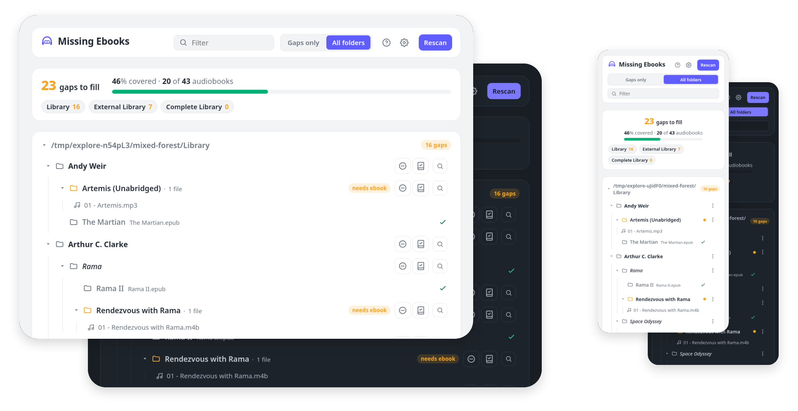

# Missing Ebooks

Self-hosted web server that scans your audiobook library and highlights folders that have audio but no matching ebook.

<a href="https://demo-missing-ebooks.noahbaculi.com">
  <picture>
    <source media="(prefers-color-scheme: dark)" srcset="docs/screenshots/readme-preview-dark.png">
    <source media="(prefers-color-scheme: light)" srcset="docs/screenshots/readme-preview-light.png">
    
  </picture>
</a>

## Live demo

Try the live demo with dummy data: ✨ [demo-missing-ebooks.noahbaculi.com](https://demo-missing-ebooks.noahbaculi.com) ✨.
Each visit opens a private, throwaway sandbox seeded with sample audiobooks. Changes stay in your session and reset when idle.

## Features

- No database: state lives as marker files in your library
- Multi-platform Docker image (amd64 and arm64)
- Responsive UI with light and dark mode
- UI buttons for simple `.no_ebook` and `.ebook_elsewhere` marker files
- Prepopulated search links (Goodreads, Google, or your own)
- Multi-root libraries, each rendered as its own tree
- Coverage detection: ebooks and markers cover their whole subtree, so container folders don't false-flag
- Live auto-refresh while a tab is open, plus on-demand `Rescan`
- Parallel scanning and cached results for slower network shares

## Getting started

Docker Compose is the easiest way to run the server. Copy the sample below, change `/path/to/audiobooks`, and start it:

```yaml
services:
  missing-ebooks:
    image: ghcr.io/noahbaculi/missing-ebooks:latest
    container_name: missing-ebooks
    ports:
      - "127.0.0.1:13379:13379"
    environment:
      MISSING_EBOOKS_LIBRARY_ROOTS: /audiobooks
    volumes:
      - /path/to/audiobooks:/audiobooks
    restart: unless-stopped
    read_only: true
    cap_drop: [ALL]
    security_opt:
      - "no-new-privileges:true"
    tmpfs:
      - /tmp
```

```shell
docker compose up -d
```

Then open http://127.0.0.1:13379.

The server reads your library and writes marker files back into it. The container runs as uid 1000 by default. If the markers need to land under a different user or group on the host (common on NAS mounts), set `user:`. See [Advanced configuration](#advanced-configuration).

The `read_only`, `cap_drop`, `security_opt`, and `tmpfs` lines keep the container narrow: read-only rootfs, no Linux capabilities, no privilege escalation, and an in-memory `/tmp`. The app writes only to the mounted library. See [.github/SECURITY.md](.github/SECURITY.md) for the rationale.

> [!WARNING]
> The server has no authentication. It binds to loopback by default, and refuses to bind a non-loopback address unless `MISSING_EBOOKS_ALLOW_PUBLIC_BIND` is set to `1`, `true`, `yes`, or `on`. The shipped Docker image sets it in its own environment (not in the compose file below), since the container binds `0.0.0.0` on purpose and exposure is controlled at the port-publish layer. To reach it from the LAN, put a reverse proxy with authentication in front of it before exposing it beyond your machine. See [.github/SECURITY.md](.github/SECURITY.md) for the full threat model and how to report a vulnerability.

## How it works

Point the server at one or more library roots. Each root is scanned and rendered as its own tree. A folder is flagged when it directly holds an audio file and nothing covers it: no ebook and no marker in that folder or any ancestor up to its root. An ebook file or marker covers everything beneath it. Folders with no audio anywhere beneath them are labelled `no audio` so a plain container reads as intentional rather than a missing row.

A `Rescan` UI button forces a cold scan (clears the server cache, walks every directory). Open pages also refresh on their own: while a tab is visible, the client polls `/refresh` every `poll_interval_seconds`, and when the returned roots fragment differs from the last one it swaps `#roots` in one shot. Scans are cached with a staleness ceiling (`scan_cache_ttl_seconds`) that caps how often the underlying walk runs regardless of how many tabs are open.

### Markers

Two fixed marker files mark a folder as covered without actual ebook files:

| Marker             | Meaning                             |
| ------------------ | ----------------------------------- |
| `.no_ebook`        | No ebook exists or could be sourced |
| `.ebook_elsewhere` | The ebook lives in another folder   |

A marker covers the folder it sits in and everything below it, the same as an ebook. Writing one into a container (an author or series folder) covers every folder under it.

## Network shares

SMB and NFS mounts work, but local disk is faster and more predictable. If your library lives on a share, raise `scan_cache_ttl_seconds` and treat the `Rescan` UI button as the deliberate refresh. On filesystems with coarse mtime (some NFS and FAT mounts), a change made inside the same mtime tick can be missed until the next cold rescan.

See [`docs/network-shares.md`](docs/network-shares.md) for more details.

## FAQ

### How long does the first scan take on a large library?

Scan time is dominated by per-directory latency, not file count. On a local SSD a few thousand folders finish in a second or two. On SMB or NFS, every folder is a round trip, so a library with tens of thousands of folders can take minutes on a cold start. Raise `scan_concurrency` to overlap the waits. See [Network shares](#network-shares) and [ADR-0019](docs/adr/0019-scan-walk-parallel-sized-by-concurrency.md).

### How do I tell an errored root apart from an unmounted volume?

Both surface at the root level, but they render differently. An errored root (canonicalization or walk failure) shows a red `scan error` badge with the OS message, so a missing mount point reads as `scan error: no such file or directory`. A root that exists but is empty (mount succeeded, no audio inside) renders as a normal root with no rows and a `no audio` note. If you see `scan error`, check the host-side mount.

### How do I upgrade?

`docker compose pull && docker compose up -d`. That fetches the current image for whichever tag you pinned and recreates the container. Pin narrowly (see the tag guidance under [Advanced configuration](#advanced-configuration)) if you want to control which upgrades you accept.

### Is there a health check endpoint?

Yes. `GET /healthz` returns 200 without touching the scanner or cache, and the image's `HEALTHCHECK` uses it (see the `Dockerfile`). Docker's `docker ps` health column reflects it.

### What happens if the host port is already bound?

Docker fails at `up` time with a bind error and the container never starts. Change the host side of the port mapping (e.g. `"127.0.0.1:13380:13379"`) or free the port. The container-internal port is fixed at 13379 unless you also set `MISSING_EBOOKS_PORT`. See [ADR-0011](docs/adr/0011-default-port-uncommon-registered.md) for why 13379.

### What state persists across restarts?

Only the marker files (`.no_ebook`, `.ebook_elsewhere`) inside your library. The scan cache is in-memory and rebuilds on the first request after start. Nothing else is written outside the mounted library roots. See [ADR-0037](docs/adr/0037-request-cap-and-rescan-cooldown.md) for the rescan cooldown behavior on top of that cache.

## Advanced configuration

Most settings can be set with environment variables. Use `config.toml` when you want to customize search links, exclusion patterns, or extension lists.

A fuller compose sample lives at [`docker-compose.advanced.yml`](docker-compose.advanced.yml). It carries a `user:` override, multiple library roots, log verbosity, and a mounted `config.toml`.

<details>
<summary>Advanced Docker Compose sample</summary>

```yaml
services:
  missing-ebooks:
    image: ghcr.io/noahbaculi/missing-ebooks:latest
    container_name: missing-ebooks
    user: "1000:1000"
    ports:
      - "127.0.0.1:13379:13379"
    environment:
      MISSING_EBOOKS_LIBRARY_ROOTS: /audiobooks_1:/audiobooks_2
      MISSING_EBOOKS_LOG: debug
    volumes:
      - /path/to/audiobooks_1:/audiobooks_1
      - /path/to/audiobooks_2:/audiobooks_2
      - ./config.toml:/config/config.toml:ro
    restart: unless-stopped
    read_only: true
    cap_drop: [ALL]
    security_opt:
      - "no-new-privileges:true"
    tmpfs:
      - /tmp
```

</details>

- `user:` sets the user the container runs as. The image defaults to `1000:1000`. Match it to whoever owns the library on the host (run `id` to find yours). This is Docker's own directive, not an app setting, so it is not in `config.toml`.
- `MISSING_EBOOKS_LIBRARY_ROOTS` takes an OS-path-separated list (colon on Unix, semicolon on Windows), so multiple roots need one mount per root and one entry per container path.
- Mount `config.toml` at `/config/config.toml`. The image auto-detects that path.

Pin the image tag for reproducible deploys. Every stable release publishes `:MAJOR.MINOR.PATCH` (e.g. `:1.0.0`), `:MAJOR.MINOR` (`:1.0`), and `:MAJOR` (`:1`), plus `:latest` for the newest stable. Pick the narrowest tag you're willing to auto-upgrade past.

### The `config.toml` file

This is optional. The Docker image auto-detects `/config/config.toml` and the CLI accepts `--config <path>`. Env vars overrule the config file, and the config file wins over the built-in defaults.

<details>
<summary>Annotated config template</summary>

<!-- A local build regenerates the same content with `cargo run -- --print-config`. -->

<!-- CONFIG_TEMPLATE:BEGIN -->

```toml
# One or more library roots. Each is scanned and rendered as its own tree.
# Required: the server exits if this is unset in every layer. Also settable as
# MISSING_EBOOKS_LIBRARY_ROOTS.
library_roots = []
# Example: library_roots = ["/path/to/audiobooks_1", "/path/to/audiobooks_2"]

# Logging is set with the MISSING_EBOOKS_LOG environment variable only.
# Can be set to: error, warn, info (default), debug, or trace.
# - debug adds per-operation timings (scans, cache, marker writes, requests).
# - trace adds a line per directory.
# RUST_LOG, if set, overrides it with full tracing filter syntax.

# Address the HTTP server binds. Loopback by default (see ADR-0003). Set
# "0.0.0.0" to listen on all interfaces. The server then refuses to start
# unless MISSING_EBOOKS_ALLOW_PUBLIC_BIND is also set to one of
# 1, true, yes, on (case-insensitive). Also settable as
# MISSING_EBOOKS_BIND.
bind = "127.0.0.1"

# HTTP listen port. An uncommon high port, away from 8080 (see ADR-0011). Also
# settable as MISSING_EBOOKS_PORT.
port = 13379

# Scan-cache staleness ceiling in seconds. Warm reads (page loads, /refresh
# polls) serve from cache while it is younger than this and force a rebuild
# otherwise. Together with poll_interval_seconds it caps how often the
# underlying scan runs regardless of open-tab count. 0 disables the cache and
# rescans on every request. /rescan is the primary freshness control for a
# user who wants to know now. Also settable as MISSING_EBOOKS_SCAN_CACHE_TTL_SECONDS.
scan_cache_ttl_seconds = 10

# Directories the library scan reads at once. The scan is bound by per-directory
# latency on a network mount (SMB/NFS), where each folder is a round trip, so
# reading several at once overlaps the waits. Size this by the speed of the
# mount, not the CPU count: the threads mostly wait on the network. One pool
# serves the whole process, so concurrent scans share it. 1 disables the
# parallelism. Also settable as MISSING_EBOOKS_SCAN_CONCURRENCY.
scan_concurrency = 16

# Client-side poll cadence. When > 0, open tabs pull /refresh every N seconds
# while the tab is visible, and scan_cache_ttl_seconds caps how often the underlying scan
# actually runs regardless of open-tab count. 0 keeps the poll marker in the
# page but suppresses the interval so the client stays quiet. Also settable as
# MISSING_EBOOKS_POLL_INTERVAL_SECONDS.
poll_interval_seconds = 10

# File extensions, compared case-insensitively. Leading dot required. The
# defaults mirror Audiobookshelf's full supported sets (see ADR-0006).
audio_exts = [".m4b", ".mp3", ".m4a", ".flac", ".opus", ".ogg", ".oga", ".mp4", ".aac", ".wma", ".aiff", ".aif", ".wav", ".webm", ".webma", ".mka", ".awb", ".caf", ".mpg", ".mpeg"]
ebook_exts = [".epub", ".pdf", ".mobi", ".azw3", ".cbr", ".cbz"]

# Marker files are not configurable. The two fixed names .no_ebook and
# .ebook_elsewhere mark a folder as covered. Both are used for detection and the
# write buttons, so they can never drift apart.

# Exact directory names to exclude (case-insensitive), applied anywhere in the
# tree. A match drops the folder and its whole subtree. Dot-prefixed entries such
# as .DS_Store and .@__thumb need no entry: any file or directory whose name
# starts with a dot is skipped automatically, matching Audiobookshelf.
excluded_dirs = []
# Example: excluded_dirs = ["@eaDir", "#recycle"]

# Glob patterns matched against the folder path relative to its library root. A
# match drops the folder and its whole subtree (see ADR-0001).
exclude_globs = []
# Example: exclude_globs = ["**/*(abridged)*", "**/*(Dramatized Adaptation)*"]

# Search-link templates. {folder} is replaced with the cleaned, URL-encoded
# folder name.
[[search_links]]
label = "Goodreads"
url = "https://www.goodreads.com/search?q={folder}"

[[search_links]]
label = "Google"
url = "https://www.google.com/search?q={folder}"
```

<!-- CONFIG_TEMPLATE:END -->

</details>

Both `scan_cache_ttl_seconds = 0` and `poll_interval_seconds = 0` are supported off-states, not misconfigurations. `scan_cache_ttl_seconds = 0` disables the scan cache and rescans on every request, which is expensive on a network mount but useful when debugging staleness. `poll_interval_seconds = 0` disables client polling. Users refresh with the `Rescan` UI button. Pairing both zeros is the recommended setup on slow SMB or NFS mounts (see [`docs/network-shares.md`](docs/network-shares.md)).

### Logging

`MISSING_EBOOKS_LOG` sets verbosity to one of `error`, `warn`, `info` (the default), `debug`, or `trace`. See [`docs/logging.md`](docs/logging.md) for per-operation timing detail and the `RUST_LOG` override.

## Migration

If you stop using missing-ebooks, remove the marker files it wrote:

```shell
find /path/to/audiobooks \( -name '.no_ebook' -o -name '.ebook_elsewhere' \) -delete
```

## Releases

Release notes and published versions: [github.com/noahbaculi/missing-ebooks/releases](https://github.com/noahbaculi/missing-ebooks/releases).

## Stability

At v1.0.0 and after, semver covers the operator-visible surface below. This is a binary and a Docker image, not a library crate, so the contract is about what an operator sees, not Rust API.

Covered by semver:

- Environment variables: `MISSING_EBOOKS_LIBRARY_ROOTS`, `MISSING_EBOOKS_CONFIG`, `MISSING_EBOOKS_BIND`, `MISSING_EBOOKS_PORT`, `MISSING_EBOOKS_LOG`, `MISSING_EBOOKS_POLL_INTERVAL_SECONDS`, `MISSING_EBOOKS_SCAN_CACHE_TTL_SECONDS`, `MISSING_EBOOKS_SCAN_CONCURRENCY`, `MISSING_EBOOKS_ALLOW_PUBLIC_BIND`. Names and semantics.
- `config.toml` keys and their types, as shipped in the `CONFIG_TEMPLATE` block above.
- Marker filenames on disk: `.no_ebook` and `.ebook_elsewhere`.
- HTTP routes the shipped UI depends on: `/`, `/healthz`, `/mark`, `/unmark`, `/rescan`, `/refresh`, `/static/htmx.min.js`, `/static/app.css`, `/static/app.js`.
- Docker image tag scheme, as described under [Advanced configuration](#advanced-configuration).

> The marker filenames are the highest-stakes item. Renaming either would silently orphan every marker a user has already written to disk.

Not covered (may change in any release):

- Rust API. No library target ships.
- Log field shapes and log line wording (see [`docs/logging.md`](docs/logging.md)).
- Rendered HTML structure and CSS class names.
- ADR numbering and internal ADR wording.
- `--print-config` output format.
- Bench harness environment variables (`CONCURRENCY` and friends) under `docs/benchmarks/`.
- The demo binary (`missing-ebooks-demo`): its router, session cookie, and 303 posture.

MSRV bumps ship in a minor release, never a patch. The current MSRV lives in `Cargo.toml`.

## License

Released under AGPL-3.0-or-later. See `LICENSE`.
