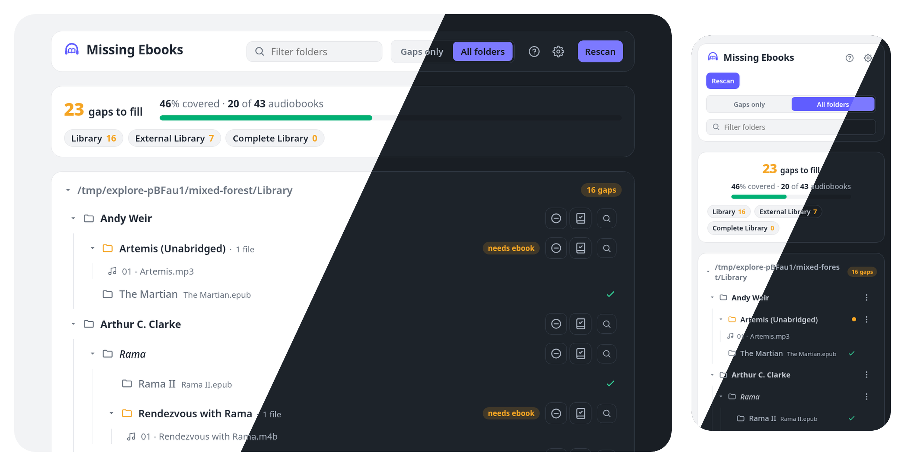

# missing-ebooks

Self-hosted web server that scans your audiobook library to highlight folders that hold audio but no matching ebook, so that gaps can be found and filled.



## Live demo

Try the live demo with dummy data: **[demo-missing-ebooks.noahbaculi.com](https://demo-missing-ebooks.noahbaculi.com)**.
Each visit opens a private, throwaway sandbox seeded with sample audiobooks. Changes stay in your session and reset when idle.

## Getting started

Docker is the supported distribution path. A multi-arch image (amd64 and arm64) is published to GitHub Container Registry. With [Docker Compose](https://docs.docker.com/compose/), drop this `docker-compose.yml` beside your other stacks, edit the volume path, and run `docker compose up -d`:

```yaml
services:
  missing-ebooks:
    image: ghcr.io/noahbaculi/missing-ebooks:latest
    container_name: missing-ebooks
    ports:
      - "127.0.0.1:13379:13379"
    environment:
      MISSING_EBOOKS_LIBRARY_ROOTS: /audiobooks
    volumes:
      - /path/to/audiobooks:/audiobooks
    restart: unless-stopped
```

Then open http://127.0.0.1:13379.

Point the volume at your library on the host. The container reads it and writes marker files back into it. The container runs as uid 1000 by default; if the markers need to land under a different user or group on the host (common on NAS mounts), set `user:`; see [Advanced configuration](#advanced-configuration).

> [!WARNING]
> The server has no authentication. It binds to loopback by default, and binding to a non-loopback address logs a warning at startup. To reach it from the LAN, put a reverse proxy with authentication in front of it before exposing it beyond your machine.

## How it works

Point the server at one or more library roots. Each root is scanned and rendered as its own tree. A folder is flagged when it directly holds an audio file and nothing covers it: no ebook and no marker in that folder or any ancestor up to its root. An ebook file or marker covers everything beneath it. Folders with no audio anywhere beneath them are labelled `no audio` so a plain container reads as intentional rather than a missing row.

A `Rescan` UI button forces a cold scan (clears the server cache, walks every directory). Open pages also refresh on their own: while a tab is visible, the client polls a warm rescan every `poll_interval_seconds` and swaps any changed root sections into the page. Scans are cached with a staleness ceiling (`ttl_seconds`) that caps how often the underlying walk runs regardless of how many tabs are open.

### Markers

Two fixed marker files mark a folder as covered without actual ebook files:

| Marker             | Meaning                             |
| ------------------ | ----------------------------------- |
| `.no_ebook`        | No ebook exists or could be sourced |
| `.ebook_elsewhere` | The ebook lives in another folder   |

A marker covers the folder it sits in and everything below it, the same as an ebook. Writing one into a container (an author or series folder) covers every folder under it.

## Advanced configuration

The defaults handle a working install. Reach for `config.toml` only to override search links, add exclusion patterns, or change extension lists. Everything else is an environment variable.

A fuller compose sample lives at [`docker-compose.advanced.yml`](docker-compose.advanced.yml). It carries a `user:` override, multiple library roots, log verbosity, and a mounted `config.toml`:

```yaml
services:
  missing-ebooks:
    image: ghcr.io/noahbaculi/missing-ebooks:latest
    container_name: missing-ebooks
    user: "1000:1000"
    ports:
      - "127.0.0.1:13379:13379"
    environment:
      MISSING_EBOOKS_LIBRARY_ROOTS: /audiobooks_1:/audiobooks_2
      MISSING_EBOOKS_LOG: debug
    volumes:
      - /path/to/audiobooks_1:/audiobooks_1
      - /path/to/audiobooks_2:/audiobooks_2
      - ./config.toml:/config/config.toml:ro
    restart: unless-stopped
```

- `user:` sets the user the container runs as. The image defaults to `1000:1000`; match it to whoever owns the library on the host (run `id` to find yours). This is Docker's own directive, not an app setting, so it is not in `config.toml`.
- `MISSING_EBOOKS_LIBRARY_ROOTS` takes an OS-path-separated list (`:` on Unix, `;` on Windows), so multiple roots need one mount per root and one entry per container path.
- Mount `config.toml` at `/config/config.toml`; the image auto-detects that path.

### The `config.toml` file

Optional. The Docker image auto-detects `/config/config.toml` and the CLI accepts `--config <path>`. Every field, its default, the environment variable that overrides it, and its rationale live in the annotated template below. Env vars win over the file, and the file wins over the built-in defaults.

<!-- A local build regenerates the same content with `cargo run -- --print-config`. -->

<!-- CONFIG_TEMPLATE:BEGIN -->

```toml
# One or more library roots. Each is scanned and rendered as its own tree.
# Required: the server exits if this is unset in every layer. Also settable as
# MISSING_EBOOKS_LIBRARY_ROOTS.
library_roots = []
# Example: library_roots = ["/path/to/audiobooks_1", "path/to/audiobooks_2"]

# Logging is set with the MISSING_EBOOKS_LOG environment variable only.
# Can be set to: error, warn, info (default), debug, or trace.
# - debug adds per-operation timings (scans, cache, marker writes, requests).
# - trace adds a line per directory.
# RUST_LOG, if set, overrides it with full tracing filter syntax.

# Address the HTTP server binds. Loopback by default (see ADR-0003). Set
# "0.0.0.0" to listen on all interfaces. The server logs a warning at startup
# when bound to a non-loopback address. Also settable as MISSING_EBOOKS_BIND.
bind = "127.0.0.1"

# HTTP listen port. An uncommon high port, away from 8080 (see ADR-0011). Also
# settable as MISSING_EBOOKS_PORT.
port = 13379

# Scan-cache staleness ceiling in seconds. Warm reads (page loads, /refresh
# polls) serve from cache while it is younger than this and force a rebuild
# otherwise. Together with poll_interval_seconds it caps how often the
# underlying scan runs regardless of open-tab count. 0 disables the cache and
# rescans on every request. /rescan is the primary freshness control for a
# user who wants to know now. Also settable as MISSING_EBOOKS_TTL_SECONDS.
ttl_seconds = 10

# Directories the library scan reads at once. The scan is bound by per-directory
# latency on a network mount (SMB/NFS), where each folder is a round trip, so
# reading several at once overlaps the waits. Size this by the speed of the
# mount, not the CPU count: the threads mostly wait on the network. One pool
# serves the whole process, so concurrent scans share it. 1 disables the
# parallelism. Also settable as MISSING_EBOOKS_SCAN_CONCURRENCY.
scan_concurrency = 16

# Client-side poll cadence. When > 0, open tabs pull /refresh every N seconds
# while the tab is visible, and ttl_seconds caps how often the underlying scan
# actually runs regardless of open-tab count. 0 keeps the poll marker in the
# page but suppresses the interval so the client stays quiet. Also settable as
# MISSING_EBOOKS_POLL_INTERVAL_SECONDS.
poll_interval_seconds = 10

# File extensions, compared case-insensitively. Leading dot required. The
# defaults mirror Audiobookshelf's full supported sets (see ADR-0006).
audio_exts = [".m4b", ".mp3", ".m4a", ".flac", ".opus", ".ogg", ".oga", ".mp4", ".aac", ".wma", ".aiff", ".aif", ".wav", ".webm", ".webma", ".mka", ".awb", ".caf", ".mpg", ".mpeg"]
ebook_exts = [".epub", ".pdf", ".mobi", ".azw3", ".cbr", ".cbz"]

# Marker files are not configurable. The two fixed names .no_ebook and
# .ebook_elsewhere mark a folder as covered. Both are used for detection and the
# write buttons, so they can never drift apart.

# Exact directory names to exclude (case-insensitive), applied anywhere in the
# tree. A match drops the folder and its whole subtree. Dot-prefixed entries such
# as .DS_Store and .@__thumb need no entry: any file or directory whose name
# starts with a dot is skipped automatically, matching Audiobookshelf.
excluded_dirs = []
# Example: excluded_dirs = ["@eaDir", "#recycle"]

# Glob patterns matched against the folder path relative to its library root. A
# match drops the folder and its whole subtree (see ADR-0001).
exclude_globs = []
# Example: exclude_globs = ["**/*(abridged)*", "**/*(Dramatized Adaptation)*"]

# Search-link templates. {query} is replaced with the cleaned, URL-encoded
# folder name.
[[search_links]]
label = "Goodreads"
url = "https://www.goodreads.com/search?q={query}"

[[search_links]]
label = "OceanofPDF"
url = "https://oceanofpdf.com/?s={query}"
```

<!-- CONFIG_TEMPLATE:END -->

### Logging

`MISSING_EBOOKS_LOG` sets verbosity to one of `error`, `warn`, `info` (the default), `debug`, or `trace`. See [`docs/logging.md`](docs/logging.md) for per-operation timing detail and the `RUST_LOG` override.

## Network shares

Pointing a library root at an SMB or NFS mount is not encouraged but I understand that many users don't have a choice. The scan is slower than on local disk and scales with the number of folders. Raise `ttl_seconds` and treat the `Rescan` UI button as the deliberate refresh. On filesystems with coarse mtime (some NFS and FAT mounts), a change made inside the same mtime tick can be missed until the next cold rescan.

See [`docs/network-shares.md`](docs/network-shares.md) for more details.

## Migration

If you want to clean up from this application, you can simply remove any marker files that may have been written:

```shell
find /path/to/audiobooks \( -name '*.no_ebook' -o -name '*.ebook_elsewhere' \) -delete
```

## Releases

Release notes and published versions: [github.com/noahbaculi/missing-ebooks/releases](https://github.com/noahbaculi/missing-ebooks/releases).

## License

Released under AGPL-3.0-or-later. See `LICENSE`.
